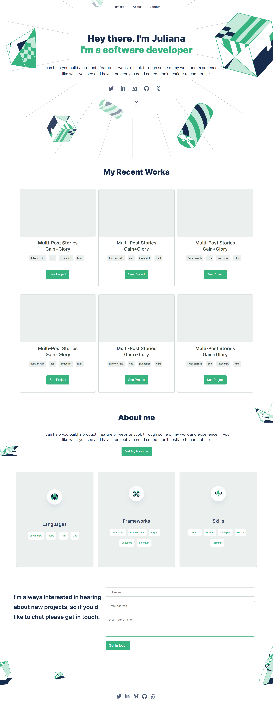

# Bootstrap-Portfolio-Project

> This is a portfolio website using bootstrap and figma template.

This project entails Building a mobile and desktop version of portfolio website using bootstrap and a design template from figma to replicate the design to the portfolio website.

## Built With

- Html
- Css
- Bootstrap

### Prerequisites

- Text editor
- Git
- Html
- Css
- Bootstrap

## Live Demo

[Live Demo Link](https://julie-ify.github.io/Portfolio-Mobile-version/)

## Getting Started

To get a local copy up and running follow these simple steps.

- You can clone this repo by typing `git clone https://github.com/julie-ify/Bootstrap-Portfolio.git` on your terminal
- Type `cd Bootstrap-Portfolio` to access the project on the terminal

## Authors

👤 **Ifionu Julie**

- GitHub: [@githubhandle](https://github.com/julie-ify)
- LinkedIn: [LinkedIn](https://www.linkedin.com/in/juliana-ifionu-4a9492212/)

👤 **Adedamola Shittu**

- GitHub: [@githubhandle](https://github.com/DammyShittu/)
- LinkedIn: [LinkedIn](linkedin.com/in/adedamola-shittu-3ab465172/)

## 🤝 Contributing

Contributions, issues, and feature requests are welcome!

Feel free to check the [issues page](https://github.com/julie-ify/Bootstrap-Portfolio/issues).

## Show your support

Give a ⭐️ if you like this project!

## 📝 License

This project is [MIT](./MIT.md) licensed.
